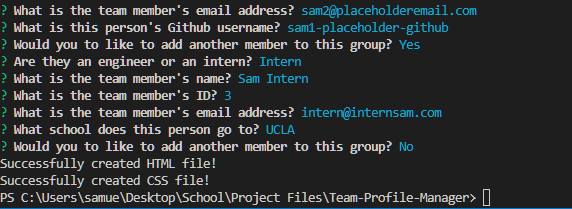

# Team-Profile-Manager

## Description

This application creates cards on an HTML page that contain info about a project team. The user can run the application via terminal which then will be prompted to ask a series of questions about each team member. The info will be neatly organized and displayed on an HTML page created within the app's /dist folder.

## Usage

Clone the repository or downlad the zip file to your local files. Navigate to the file through a console and enter "npm i".

After the dependencies are installed, type "node index.js" in the console and it will begin the series of questions.

Once the questionnaire has been completed, the HTML files will be created in the /dist folder.

## Links

Repository Link: https://github.com/Sam-T-G/Team-Profile-Manager

Video Link of functioning application: https://drive.google.com/file/d/1ETrfF2P_xIgVUC7GzvcnmVLAiY-ZKInY/view
